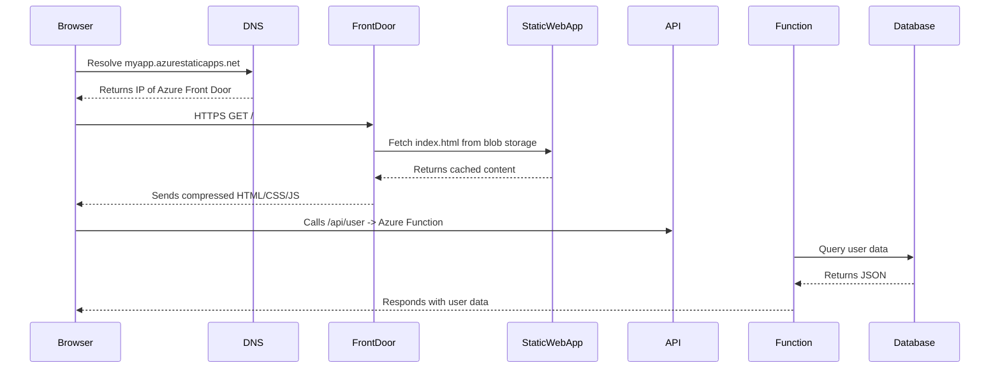

# 

## Scenario:

You’ve hosted a UI (say a React or Angular app) in Azure Static Web Apps or Azure App Service.
You type a URL (like https://myapp.azurewebsites.net) into your browser and hit Enter.

### 1. DNS Resolution

When you hit Enter, the browser needs to figure out where to send your request.

- Your URL’s domain (myapp.azurewebsites.net or custom app.mydomain.com) is sent to a DNS resolver.

- The resolver queries DNS servers to find the IP address of the Azure Front Door or App Service endpoint.

- Azure uses Azure DNS or external DNS providers to resolve this.

- Once resolved, the IP is cached locally for faster future lookups.

> Key behind-the-scenes:
If you’ve mapped a custom domain, Azure Front Door or App Service automatically provisions SSL/TLS certificates (via DigiCert or Let’s Encrypt) to handle secure HTTPS traffic.

## 2. Network Routing via Azure Edge (Front Door / CDN)

Once your browser knows the IP, it makes an HTTPS request to that endpoint.

- The request typically first lands on Azure Front Door’s global edge network — Microsoft’s global CDN layer.

- This edge node:

      Handles TLS termination (decrypts HTTPS),
      
      Performs caching (if enabled),
      
      Applies WAF (Web Application Firewall) rules,

      Routes the request to the closest App Service or Static Web App origin region.

> Key insight:
Azure Front Door provides global load balancing, so your request might be served by the nearest edge POP (Point of Presence) — reducing latency.

## 3. Application Hosting Layer

Depending on how your UI is hosted, the next step differs slightly:

#### If using Azure Static Web Apps

- The request goes to an Azure Storage (Blob)-backed static content endpoint.

- Azure automatically serves your prebuilt index.html, CSS, JS, and asset files.

- Any route not found (e.g., /dashboard) is automatically rewritten to index.html (client-side routing support).

> Bonus:
If your app uses API routes (/api/...), they’re automatically proxied to an Azure Function running alongside your static content.

#### If using Azure App Service

The request hits a load balancer that routes traffic to one of your App Service instances (VMs).

Inside the instance:

- The IIS or Kestrel web server receives the request.

- The server serves your static assets or executes backend logic if needed.

- App Service runs in a sandboxed container on Azure’s shared or dedicated compute.

> Key insight:
App Service manages auto-scaling, health checks, and cold starts automatically behind the scenes.

---

### 4. Azure Networking Magic

Throughout this process:

- **Azure Traffic Manager** (optional) may direct traffic to different regions.

- **Azure CDN** might cache your static assets at the edge for better performance.

- **Azure Load Balancer** distributes incoming requests across instances.

- **Application Gateway** can add another layer for SSL termination, routing, or WAF.

### 5. Data & API Layer (if applicable)

If your UI makes API calls:

- Calls are routed (often via HTTPS) to Azure Functions, App Services, or AKS microservices.

- Azure Application Insights traces these requests and logs telemetry.

The APIs might interact with:

- Azure Cosmos DB / Azure SQL for data

- Azure Service Bus for messaging

- Azure Key Vault for secrets

### 6. Response Path

After the app or static content responds:

- The response goes back through:

      The App Service / Static Web App origin
      
      Azure Front Door or CDN
      
      The public Internet backbone
      
      To your browser

- The browser then renders HTML, executes JS, and loads styles.

### 7. Observability & Telemetry

All the while, Azure is collecting data:

- Application Insights logs request duration, exceptions, dependencies.

- Azure Monitor aggregates performance metrics.

- Front Door analytics records cache hits/misses and latency.

- You can view all of this in Azure Portal or Grafana dashboards.

# Summary: What Really Happens When You Hit Enter

| Step | Layer        | Key Azure Component           | Role                               |
| ---- | ------------ | ----------------------------- | ---------------------------------- |
| 1    | DNS          | Azure DNS                     | Resolves your domain               |
| 2    | Network Edge | Azure Front Door / CDN        | Routes, caches, and terminates SSL |
| 3    | Hosting      | App Service / Static Web Apps | Serves content                     |
| 4    | Compute      | Load Balancer / Function App  | Executes app logic                 |
| 5    | Data         | Azure SQL / Cosmos DB         | Stores & retrieves data            |
| 6    | Telemetry    | Application Insights          | Monitors performance               |

## Example: React app in Azure Static Web Apps

This diagram shows what happens when a user accesses an Azure-hosted UI (e.g., Static Web App or App Service) and the data flow between components.

