# Microsoft Azure Practices

        In this tutorial, you will learn:

           •  Define cloud computing
           •  Describe the shared responsibility model
           •  Define cloud models, including public, private, and hybrid
           •  Identify appropriate use cases for each cloud model
           •  Describe the consumption-based model
           •  Compare cloud pricing models
           •  Describe serverless

## What is cloud computing?

        Cloud computing is the delivery of computing services—including servers, storage, databases, networking, software, analytics, and intelligence—over the internet (“the cloud”) to offer faster innovation, flexible resources, and economies of scale. 

        typically pay only for cloud services we use, 

                helping us lower our operating costs, 

                run our infrastructure more efficiently, and 

                scale as our business needs change.

        In simply, we can say like Computing services over the Internet:

                •  Compute
                •  Networking
                •  Storage
                •  Databases
                •  Internet of Things
                •  Big Data and Analytics
                •  Artificial Intelligence (AI)
                •  Serverless computing
                •  DevOps solutions
                •  Pay-as-you-go pricing model
                •  “Rent” services only for the duration that they are being used.
                •  Global
                •  Host your services in data centres around the world.  

## benefits of using cloud services

### High Availability (HA)

        • Have little downtime even when there are problems.

                When you’re deploying an application, a service, or any IT resources, it’s important the resources are available when needed. 

                High availability focuses on ensuring maximum availability, regardless of disruptions or events that may occur.

                When you’re architecting your solution, you’ll need to account for service availability guarantees. 

                Azure is a highly available cloud environment with uptime guarantees depending on the service. 

                These guarantees are part of the service-level agreements (SLAs).

### Scalability

        • Scale up (vertically) – better machine (more RAM or compute)

        • Scale out (horizontally) – more machines

### Elasticity

        • The ability to rescale, including autoscale

### Agility

        • Quick deployment

### Disaster recovery (DR)

        • How to recover from a problem – Backups, data replication, geo-distribution

### Managed

        • You don’t have to take care of everything.

### Accessible

        • Users can access over the world.

### Geo-distributed

        • Use data centres all over the world

## core architectural components of Azure

## cloud service models

If you've been around cloud computing for a while, you've probably seen the PaaS, IaaS, and SaaS acronyms for the 
different cloud service models. 

These models define the different levels of shared responsibility that a cloud provider and cloud tenant are responsible for.

The following illustration demonstrates the services that might run in each of the cloud service models:

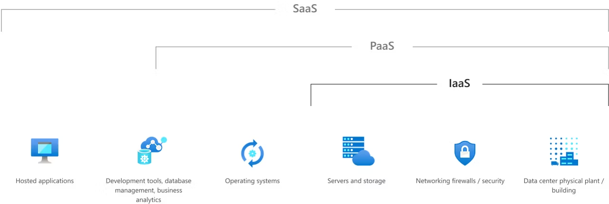

## IAAS

### Shared responsibility model:

Scenarios

Some common scenarios where IaaS might make sense include:

        Lift-and-shift migration: You’re setting up cloud resources similar to your on-prem datacenter, and then simply moving the things running on-prem to running on the IaaS infrastructure.

        Testing and development: You have established configurations for development and test environments that you need to rapidly replicate. You can start up or shut down the different environments rapidly with an IaaS structure, while maintaining complete control.

## PASS

### Shared responsibility model:

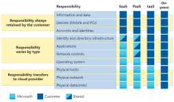

Scenarios

Some common scenarios where PaaS might make sense include:

Development framework: 

        PaaS provides a framework that developers can build upon to develop or customize cloud-based applications. Similar to the way you create an Excel macro, PaaS lets developers create applications using built-in software components. Cloud features such as scalability, high-availability, and multi-tenant capability are included, reducing the amount of coding that developers must do.

Analytics or business intelligence: 

        Tools provided as a service with PaaS allow organizations to analyze and mine their data, finding insights and patterns and predicting outcomes to improve forecasting, product design decisions, investment returns, and other business decisions.

## SAAS

### Shared responsibility model:

Scenarios

Some common scenarios for SaaS are:

Email and messaging.
Business productivity applications.
Finance and expense tracking.

## What is azure?

        Microsoft Azure is a cloud computing platform with an ever-expanding set of services to help you build solutions 
        to meet our business goals. 

        Azure services support everything from simple to complex. 

        Azure has simple web services for hosting your business presence in the cloud. 

        Azure also supports running fully virtualized computers managing your custom software solutions. 

        Azure provides a wealth of cloud-based services like remote storage, database hosting, and 
        centralized account management. 

        Azure also offers new capabilities like artificial intelligence (AI) and Internet of Things (IoT) focused services.

## Get started with Azure accounts

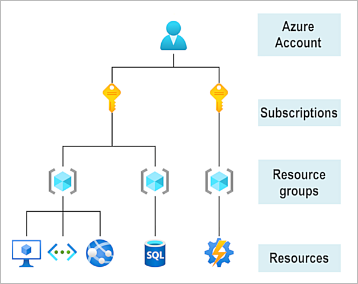

## Exercise - Create a website hosted in Azure

As a developer for Tailwind Traders, you likely have expertise creating applications. As you migrate to Azure, many of the steps that you'll follow to set up a website in the cloud will parallel the steps that you followed when you created websites in your company's datacenter. For example, you need to choose where you'll create your website, and then allocate the necessary resources. In Azure, the physical hardware is managed for you, so your tasks are to choose where your website will be located and which resources to provide.

In this exercise, you'll create an Azure App Service instance to host a WordPress website.

Activate a sandbox to complete this exercise

This exercise requires you to use a sandbox on Microsoft Learn to complete. 
A sandbox gives you access to Azure resources. Your Azure subscription will not be charged. The sandbox may only be used to complete training on Microsoft Learn. Use for any other reason is prohibited, and may result in permanent loss of access to the sandbox.

Sign in to activate sandbox

Azure terminology and concepts

Before you get started, let's review and discuss some basic terms and concepts that you'll need to know when you create your website.

### What is App Service?

        App Service is an HTTP-based service that enables you to build and host many types of web-based solutions without managing infrastructure. For example, you can host web apps, mobile back ends, and RESTful APIs in several supported programming languages. Applications developed in .NET, .NET Core, Java, Ruby, Node.js, PHP, or Python can run in and scale with ease on both Windows- and Linux-based environments.

        For this exercise, we want to create a website in less than the time it takes to eat lunch. So, we're not going to write any code. Instead, you'll deploy a predefined application from Azure Marketplace.

### What is Azure Marketplace?

        Azure Marketplace is an online store that hosts applications that are certified and optimized to run in Azure. Many types of applications are available, ranging from AI and machine learning to web applications. As you'll see in a couple of minutes, deployments from the store are done via the Azure portal by using a wizard-style user interface. This user interface makes evaluating different solutions easy.

        We're going to use one of the WordPress application options from Azure Marketplace for our website.

### Create resources in Azure

        Typically, the first thing we'd do is to create a resource group to hold all the things that we need to create. The resource group allows us to administer all the services, disks, network interfaces, and other elements that potentially make up our solution as a unit. We can use the Azure portal to create and manage our solution's resource groups. Keep in mind that you can also manage resources via a command line by using the Azure CLI. The Azure CLI is a useful option if you need to automate the process in the future.

        In the free Azure sandbox environment, you'll use the pre-created resource group [sandbox resource group name], and you don't need to do this step.

Choose a location

The free sandbox allows you to create resources in a subset of the Azure global regions. Select a region from this list when you create resources:

        westus2

        southeastasia

        japaneast

        brazilsouth

        australiasoutheast

        centralindia

        southcentralus

        centralus

        eastus

        westeurope

### Create a WordPress website

1. If you haven't done so already, verify that you've activated the sandbox. Activating the sandbox allocates the subscription and resource group you'll use in this exercise. This step is required for any Microsoft Learn exercises that use a sandbox.

2. Sign in to the Azure portal by using the same account you used to activate the sandbox.

3. On the top of the Azure portal left pane, select Create a resource.

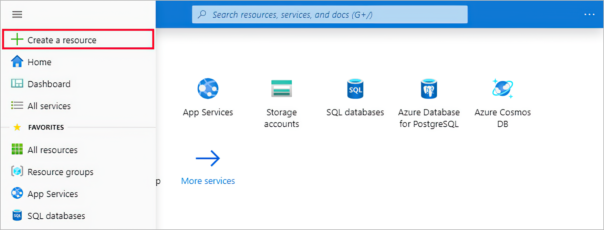

This option takes you to Azure Marketplace.

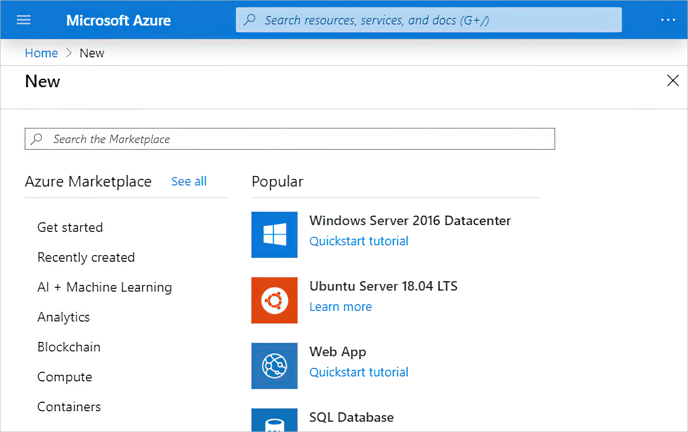

4. Azure Marketplace has many services, solutions, and resources available for you to use. We know that we want to install WordPress, so we can do a quick search for it. In the Search the Marketplace box with the listed application options, enter WordPress. Select the default WordPress option from the list of options available.

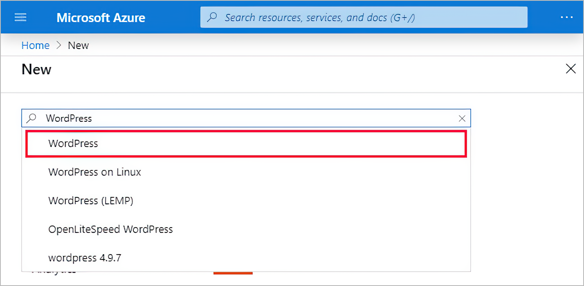

5. In the pane that appears, you'll typically find more information about the item you're about to install, such as the publisher, a brief description of the resource, and links to more information. Make sure to review this information. Select Create to begin the process to create a WordPress app.

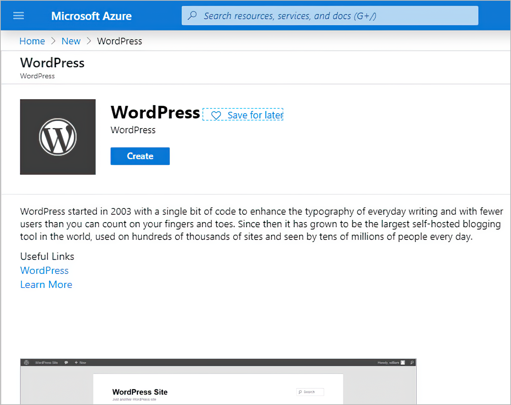

6. Several options to configure your deployment appear. Enter the following information:

Property                     Value

App name                     Choose a unique value for the app name. It will form part of a fully qualified domain name (FQDN).

Subscription                 Make sure Concierge Subscription is selected.

Resource Group               Select the Use existing option, and then select the [sandbox resource group name] resource group from the dropdown.

Database Provider            From the dropdown, select MySQL in App.

App Service plan/Location    You'll change the App Service plan in the next step.

Application Insights         Leave at the default configuration.

Your configuration should look like this example:

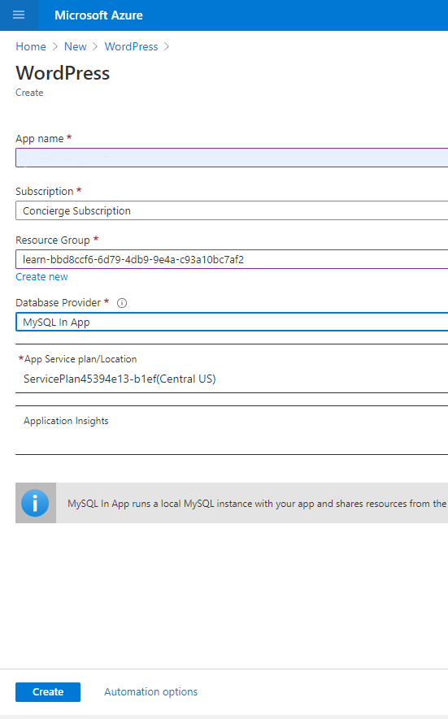

7. Now let's configure the App Service plan to use a specific pricing tier. The App Service plan specifies the compute resources and location for the web app. Select App Service plan/Location.

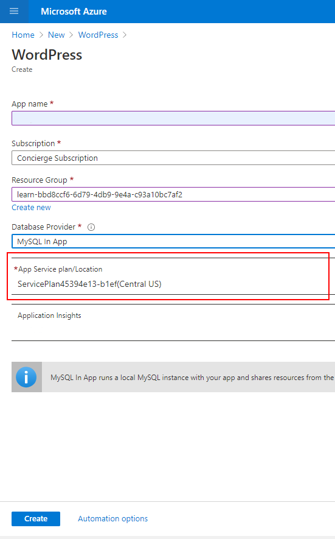

8. In the App Service plan pane, select Create new.

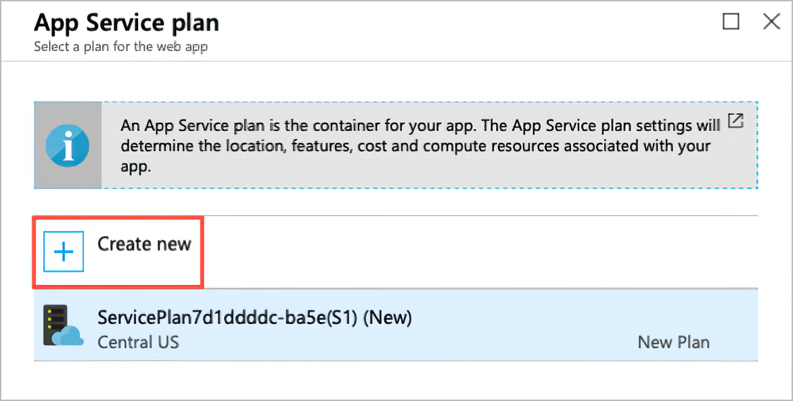

9. In the New App Service plan pane, enter a name for the new service plan.

10. For Location, select Central US to make sure we choose a region that allows the service plan you'll choose. Normally, you'll select the region that's closest to your customers while offering the services you need.

11. Select Pricing tier to see the performance and feature options of the various types of service plans.

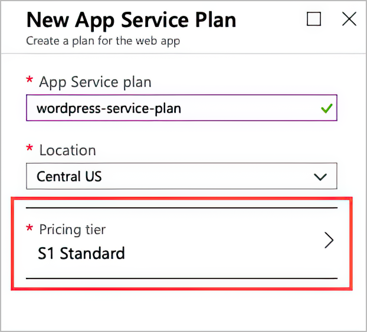

12. The Spec Picker allows us to select a new pricing tier for our application. This screen opens to the Production tab, with the S1 pricing tier selected. We'll select a new pricing tier from the Dev / Test tab for our website.

Select the Dev / Test tab, then select the F1 pricing tier, and then select Apply.

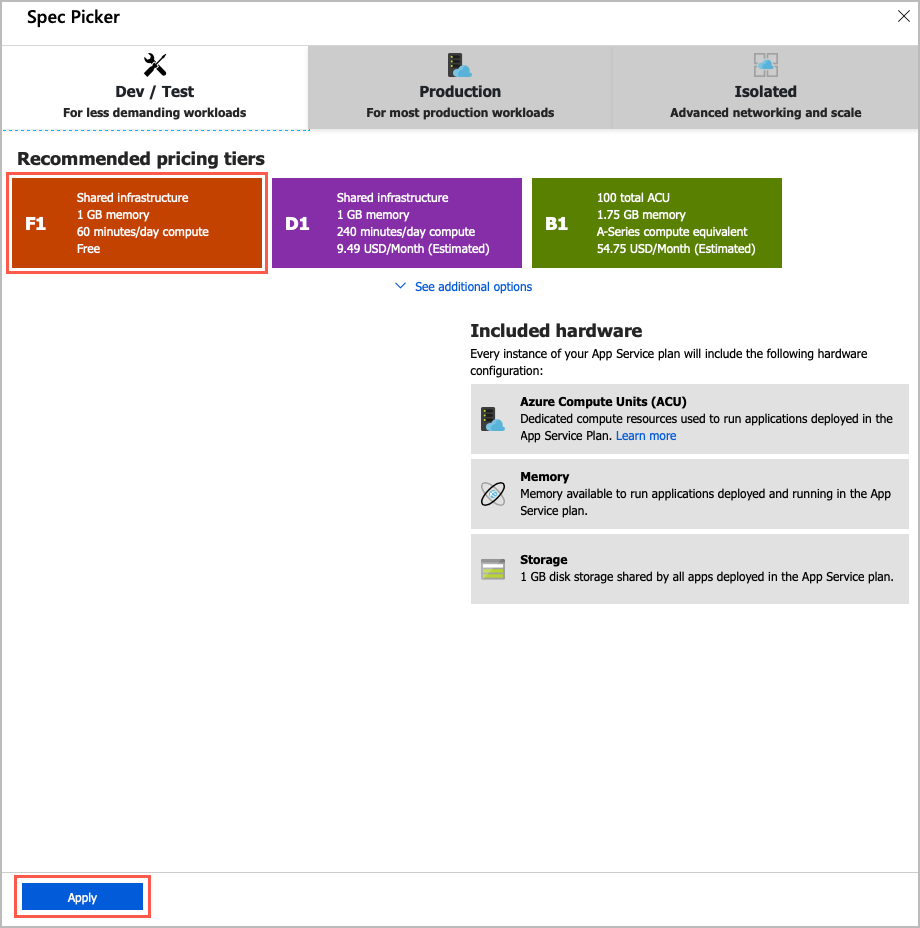

Screenshot of the Azure portal showing the App Service plan Spec Picker pane with the Dev / Test section selected and the free F1 tier and the Apply button highlighted

13. Back on the New App Service plan pane, select OK to create the new plan, and close the pane.

14. Finally, select the Create button to start the deployment of your new site.

Verify your website is running

The deployment of the new website can take a few minutes to complete. You're welcome to explore the portal further on your own.

We can track the progress of the deployment at any time.

Select the Notifications bell icon at the top of the portal. If your browser window width is smaller, it might be shown when you select the ellipsis (...) icon in the upper-right corner.

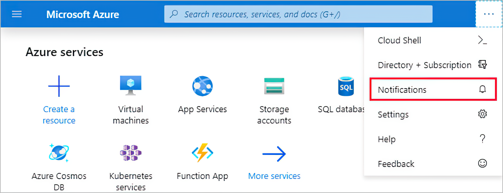

2. Select Deployment in progress to see the details about all the resources that are created.

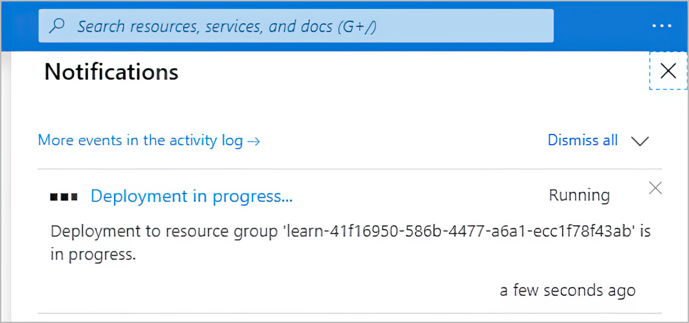

Notice how resources are listed as they're created and the status changes to a green check mark as each component in the deployment completes.

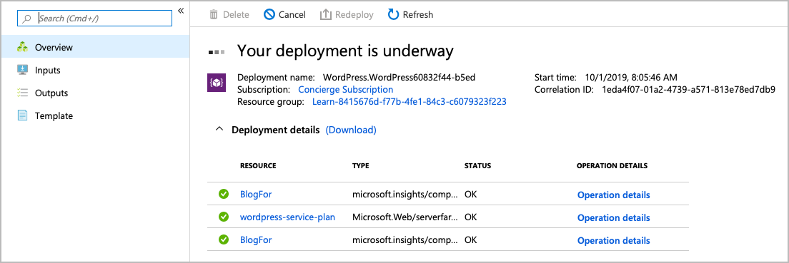

3. After the deployment status message changes to Your deployment is complete, you'll notice the status in the Notifications dialog box changes to Deployment succeeded. Select Go to resource to go to the App Service overview.

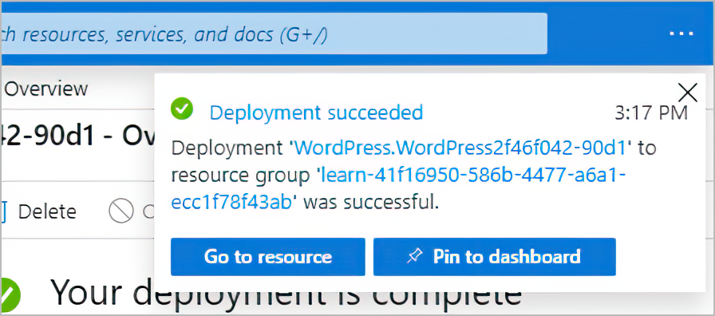

4. Find the URL in the Overview section.

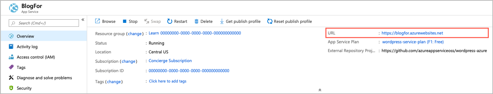

5. Copy the URL information by selecting the Copy to clipboard icon at the end of URL.

6. Open a new tab in your browser, paste this URL, and press Enter to browse to your new WordPress site. You can now configure your WordPress site, and add content.

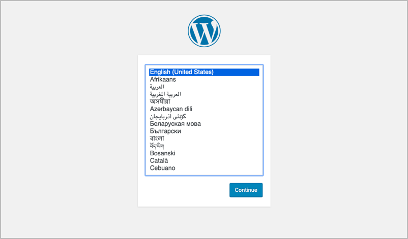

## certification Links:

### AZ-900: 

        Sandbox:

                https://learn.microsoft.com/en-us/credentials/certifications/azure-fundamentals/?practice-assessment-type=certification
   
        Exam:    
                https://learn.microsoft.com/en-us/credentials/certifications/resources/study-guides

